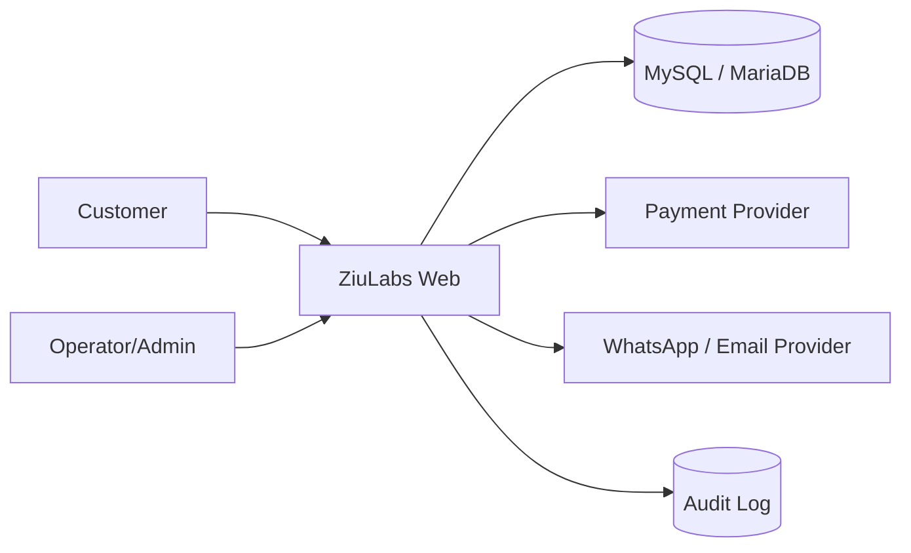
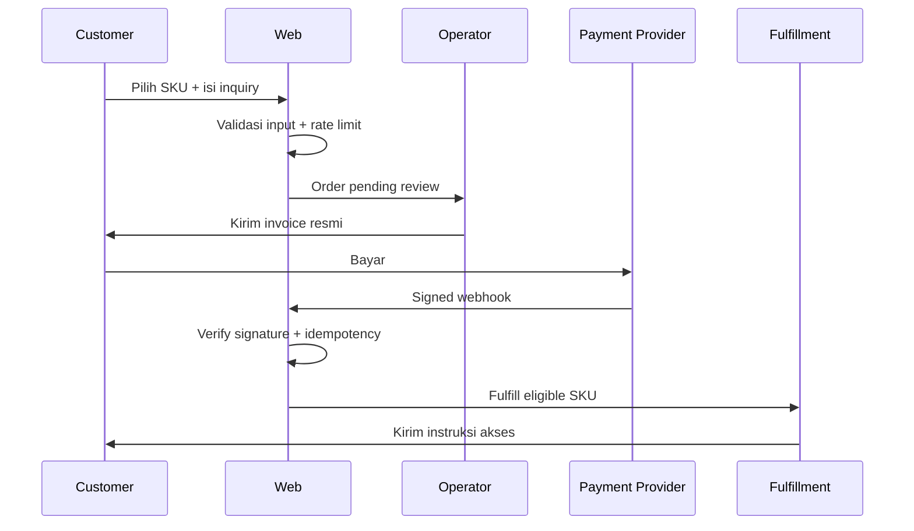

# ZiuLabs — System Design

## Keputusan utama

ZiuLabs dibangun sebagai SaaS katalog dan commerce untuk produk digital. Tahap pertama menggunakan arsitektur **modular monolith PHP**. Pola ini dipilih karena tim masih kecil, domain bisnis belum stabil, dan biaya operasional harus rendah. Batas modul dibuat sejak awal agar sistem dapat dipisahkan menjadi service hanya jika beban dan kebutuhan organisasi membenarkannya.

> Produk digital tidak boleh diperlakukan sebagai komoditas tanpa asal-usul. Sistem wajib menyimpan sumber, bukti hak distribusi, kebijakan penggunaan, masa berlaku akses, dan status fulfillment untuk setiap SKU.

## Konteks bisnis

Pengguna datang dari landing page, menemukan kategori, membandingkan paket, lalu meminta order. Operator memverifikasi stok dan kelayakan produk. Setelah pembayaran dikonfirmasi melalui provider yang sah, sistem membuat order, mencatat fulfillment, dan mengirim instruksi akses melalui kanal resmi. Refund dan dispute ditangani dengan audit trail.

Batas MVP adalah katalog, inquiry order, dan admin-ready data model. Pembayaran otomatis, provisioning, dan rekonsiliasi disiapkan sebagai modul berikutnya karena ketiganya memiliki risiko legal dan operasional yang lebih tinggi.

## C4 level 1 — konteks sistem

## C4 level 2 — container

| Container | Tanggung jawab | Teknologi awal |
|---|---|---|
| Public web | Landing page, katalog, FAQ, inquiry | PHP 8.2, server-rendered HTML, CSS, vanilla JS |
| Application modules | Catalog, order, user, fulfillment, policy | PHP modular monolith |
| Database | Product, SKU, order, payment, fulfillment, audit | MySQL/MariaDB |
| Admin surface | CRUD produk, order queue, verification | PHP views + RBAC |
| Integrations | Payment webhook, messaging, analytics | Adapter interfaces |

## Batas modul

`Catalog` hanya membaca produk yang berstatus `published` dan `compliance_verified`. `Order` membuat snapshot harga dan terms pada waktu checkout. `Payment` hanya memproses event yang ditandatangani dan idempotent. `Fulfillment` tidak pernah menampilkan secret produk di log. `Audit` menerima event append-only untuk aktivitas sensitif.

## Alur order target

## Non-functional requirements

Availability target MVP adalah 99.5% pada jam operasional. Semua halaman publik harus dapat dirender tanpa JavaScript. Target respons server p95 adalah di bawah 500 ms untuk halaman katalog tanpa query berat. Backup database dilakukan harian dan pemulihan diuji bulanan. Rahasia hanya berasal dari environment atau secret manager.

## Deployment

Document root menunjuk ke `php-app/public`. PHP-FPM berjalan di belakang Nginx atau Apache. Database berada di jaringan privat. HTTPS wajib. Worker queue dan cron dipisahkan dari web process ketika payment dan fulfillment sudah diaktifkan.

## Keputusan yang belum final

Provider pembayaran, provider email, sumber katalog, dan strategi multi-tenant belum dikunci. Keputusan tersebut harus melalui ADR tersendiri karena dapat mengubah model data dan kebijakan compliance.

## References

[1]: https://owasp.org/www-project-application-security-verification-standard/ "OWASP Application Security Verification Standard"
[2]: https://12factor.net/ "The Twelve-Factor App"
